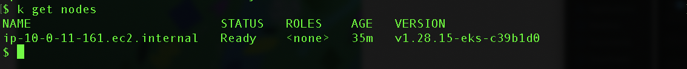
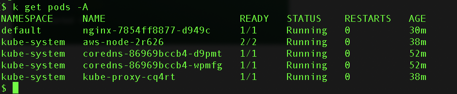
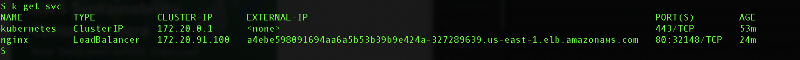
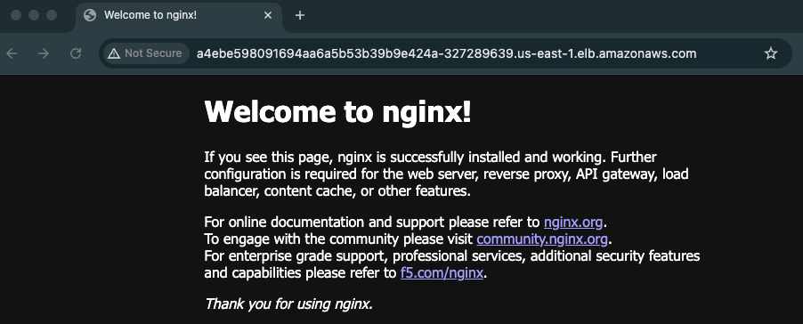
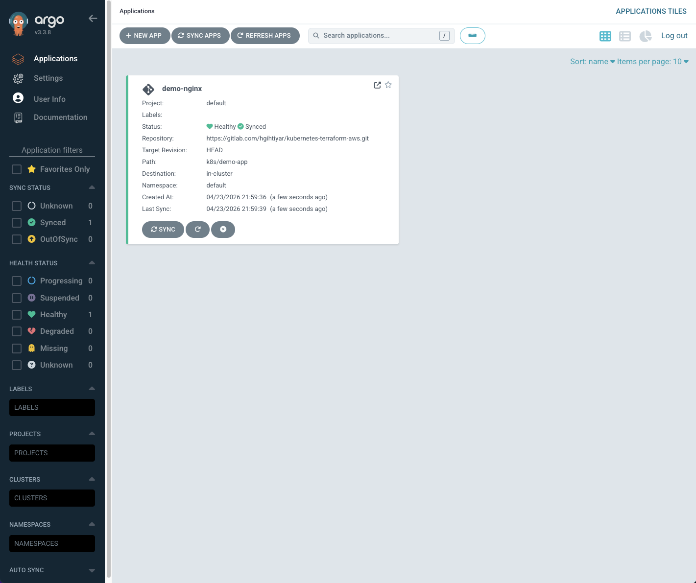
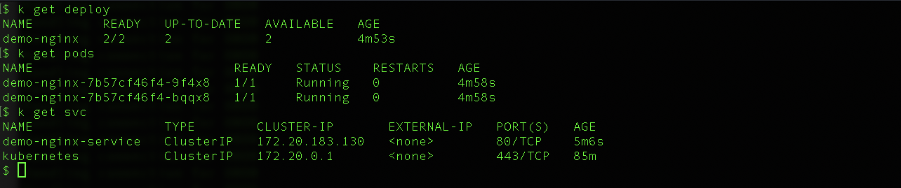
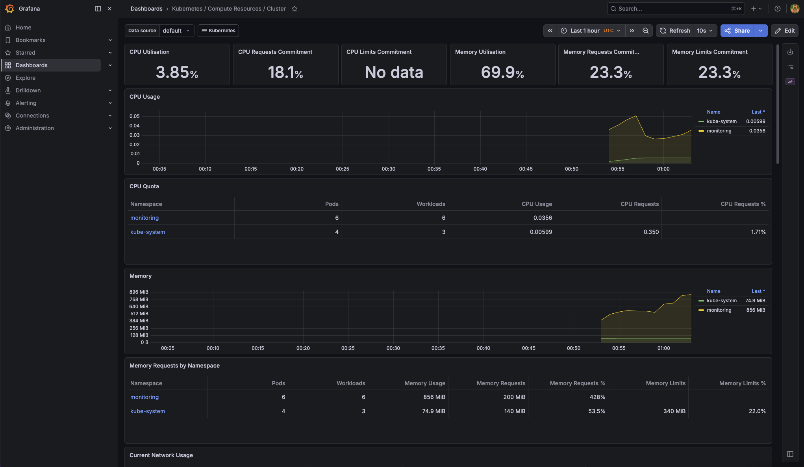

[](https://gitlab.com/hgihtiyar/kubernetes-terraform-aws/-/pipelines)
# Kubernetes Infrastructure on AWS with Terraform
Production-style Kubernetes infrastructure on AWS provisioned with Terraform, designed for repeatability, environment separation, and operational readiness.

## Overview
This project provisions a production-style Kubernetes platform on AWS using Terraform. The goal is to demonstrate automation-first infrastructure design with environment separation, repeatable provisioning, and operational readiness rather than a minimal demo setup.

## Tech Stack
- Terraform
- AWS
- Amazon EKS
- Kubernetes
- Amazon VPC
- S3
- DynamoDB
- AWS CLI
- kubectl

## Architecture


## Current Implementation
The current implementation includes:

- Terraform bootstrap for remote state infrastructure
- Amazon S3 backend for Terraform state
- DynamoDB table for state locking
- AWS VPC with public and private subnets across multiple Availability Zones
- Amazon EKS cluster provisioned with Terraform
- EKS managed node group for worker nodes
- Environment-based structure for infrastructure organization
- IRSA configuration for fine-grained AWS access from Kubernetes workloads
- Argo CD GitOps workflow for Kubernetes application deployment

## Platform Design
The platform is designed around the following components:

- AWS VPC with public and private subnets
- Amazon EKS as the managed Kubernetes control plane
- EKS managed node groups for worker nodes
- Terraform-managed infrastructure with reusable environment structure
- Remote state and locking for safer infrastructure workflows

## Design Decisions

### Infrastructure as Code as the Single Source of Truth
All infrastructure is defined declaratively in Terraform to improve consistency, traceability, and repeatability.

### Environment Separation
Infrastructure is organized by environment to reduce drift and support safer changes over time.

### Remote State with Locking
Terraform state is stored in S3 with DynamoDB locking to prevent concurrent modifications and improve workflow safety.

### Separation of Concerns
The project separates bootstrap infrastructure, core platform provisioning, and future application deployment workflows.

## Validation
After provisioning the infrastructure, I validated the environment by:

- updating kubeconfig with the AWS CLI
- confirming node readiness with `kubectl get nodes`
- verifying core system pods with `kubectl get pods -A`
- deploying an NGINX workload
- exposing the workload with a LoadBalancer Service
- confirming external access in the browser

## Validation Screenshots

### Node Ready


### System Pods


### Service Exposure


### Browser Test


## Challenges and Fixes

During the build, I encountered and resolved several practical infrastructure and deployment issues:

- replaced an old S3 backend bucket from a previous AWS account with a new remote state backend
- cleaned up stale Terraform state from an earlier setup
- rebuilt AWS CLI authentication using a new AWS account and IAM user
- resolved EKS managed node group provisioning issues related to Kubernetes version and AMI compatibility
- configured GitLab CI/CD pipeline with AWS credentials stored as CI/CD variables
- resolved Terraform variable input errors in CI by using a var-file
- resolved IAM permission issues for KMS and CloudWatch during pipeline apply
- troubleshot Argo CD pod readiness issues and improved cluster capacity by increasing the EKS managed node group desired size from 1 to 2 worker nodes
- validated cluster access, workload readiness, observability, and GitOps deployment using AWS CLI, kubectl, Argo CD, Prometheus, and Grafana

## CI/CD

The project includes a working GitLab CI/CD pipeline with the following stages:

- **validate** — runs `terraform fmt` and `terraform validate` without connecting to remote state
- **plan** — initializes backend, runs `terraform plan`, and saves the plan as an artifact
- **apply** — applies the saved plan with manual approval required
- **destroy** — tears down all infrastructure with manual approval required

## GitOps with Argo CD

This project includes a GitOps workflow using Argo CD on Amazon EKS.

Argo CD is installed inside the Kubernetes cluster and continuously monitors Kubernetes manifests stored in the Git repository. The demo application is defined under:

`k8s/demo-app`

The demo application includes:

- Kubernetes Deployment for an NGINX application
- Kubernetes Service for internal cluster access
- Two running replicas managed by Kubernetes
- Automatic synchronization from Git to the EKS cluster through Argo CD

Current GitOps workflow:

`Local changes → GitLab push → Argo CD sync → EKS deployment`

The Argo CD application successfully reached:

`Status: Healthy`  
`Sync: Synced`

### Argo CD Application Status



### Kubernetes Deployment Verification



This demonstrates a production-style GitOps deployment model where Kubernetes application manifests are stored in Git and continuously reconciled by Argo CD.

## Security

Current security practices include:

- private subnets for worker nodes
- IAM-based access control through AWS and EKS
- remote state protection through encryption and access controls
- IAM Roles for Service Accounts (IRSA) for fine-grained workload permissions
- S3 read-only access validation through IRSA

Planned security improvements include:

- integration with AWS Secrets Manager or AWS Systems Manager Parameter Store for secrets handling
- additional Kubernetes policy enforcement for workload security

## Observability

The observability stack is deployed using Helm and includes:

- **Prometheus** for metrics collection
- **Grafana** for visualization and dashboards
- **Alertmanager** for alerting

### Grafana Dashboard



## Repository Structure

```bash
terraform/
├── bootstrap/           # remote state backend resources
└── environments/
    └── dev/             # development environment infrastructure

k8s/
└── demo-app/            # Kubernetes manifests managed by Argo CD

diagrams/                # architecture diagrams
screenshots/             # validation screenshots
```

## Roadmap
- [x] Remote state backend (S3 + DynamoDB locking)
- [x] VPC implementation
- [x] EKS cluster
- [x] Managed node group
- [x] Sample workload deployment and browser validation
- [x] IRSA configuration
- [x] GitLab CI pipeline for plan/apply/destroy workflow
- [x] Observability stack (Prometheus / Grafana)
- [x] GitOps extension with Argo CD

## Notes
This project demonstrates a portfolio-quality Kubernetes platform engineering workflow focused on automation, environment separation, operational safety, observability, and GitOps-based application delivery.
